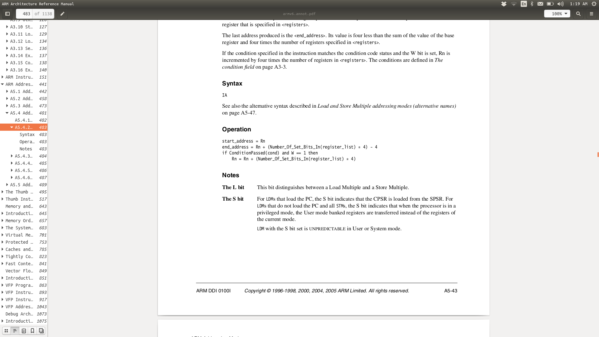

Today's lab will do a partial integration of the pieces you've written
into a small OS that has virtual memory and user processes.

I'm still writing a piece of the code, so this might be two small labs
rather than one, but at the very least you'll have a real virtual memory
with single stepping.

For the first couple of parts, we'll start by adding to a copy of your 
lab 10 to keep new stuff to a minimum.  Then we'll flip that code into 
a more full fledged code base.

--------------------------------------------------------------------
Part 0: fix our context saving and restoring!

It turns out there was an interesting bug in our context switching code.
When doing single stepping, we can't simply do:

        ldm r0, {r0-r15}^

to reload user state.  If you look at the ARMv6 document, you'll see
`ldm` behaves differently depending on if you have the `pc` (`r15`)
as one of the registers.

<table><tr><td>
  
</td></tr></table>

This bug is a bit interesting in that we missed this nuance for the past
4-5 years but had managed to avoid getting bitten by it despite doing
context switching in different ways b/c of how it was implemented.
We didn't realize the bug in lab 10 because we had no other process
running.

In any case, first step is to fix your code to use `rfe` and (if you
want) `srs` to restore and save state. If you look at the `prelab-code`
directory you'll see an example that uses them.  You'll want to look in 
the ARMv6 manual to make sure you understand.

What to do:
   1. Copy your `10-process/code` into `15-integration/code` (we never
      want to mutate a working system that we've already checked).
   2. Make sure your tests run as before.
   3. Rewrite the equivalance assembly to use the `rfe` instructon 
      at the end.
   4. Make sure your tests still pass!

--------------------------------------------------------------------
Part 1: save state to a process structure

For our OS we'll want to save the current registers into a process
structure rather than onto a random exception stack.  For this part,
define a trivial process structure in the `fake-os.h` header
along with a pointer to a global variable:

    typedef struct {
        // register save area: keep it at offset 0 for easy
        // assembly calculations.
        uint32_t reg_save[16 + 1];  // 16 general purpose registers + spsr

        // used by the equiv code.
        pix_equiv_t ctx;
    } pix_env_t;

    extern pix_env_t *pix_cur_process;

    

You'll make the following changes:

   0. In `fake-os.c`: Allocate global `pix_env_t` and set
      `pix_cur_process` to point to it.

   1. Make a copy of your assembly and have it load the location to 
      save registers to using the `pix_cur_process` variable.  You
      might want to look at the old interrupt code to see how to do 
      this easily in assembly.

   2. Rerun your code to make sure it still gives the same checksums.

   3. Make a copy of your equivalance code that stores the current context
      in this process structure and uses it to track the current hash.
      Have the assembly routine from (1) pass a pointer to the current
      context structure in.

   4. Rerun your code and make sure it still gives the same checksums.
      (You'll notice a pattern: this is how I always make changes so 
       that I don't have to think that hard.)

   5. Initialize your process structure save area so the registers
      in it have the same values as would be set by your `user_mode_run_fn`.
      Write a `switchto_asm` routine that takes a pointer to the `reg_save`
      array and loads everything: use this instead of the `user_mode_run_fn`.

            // reg_save offsets for the different registers.
            enum {
                SP_OFF = 13,
                PC_OFF = 15,
                SPSR_OFF = 16,
            };

            pix_env_t pix_env_mk(uint32_t pc, uint32_t sp) {
                pix_env_t p = {0};
            
                p.reg_save[0] = pc;
                p.reg_save[1] = sp;
                p.reg_save[SPSR_OFF] = 0x190;
                p.reg_save[PC_OFF] = pc;
                p.reg_save[SP_OFF] = sp;
                return p;
            }

      Then you should be able to call `switchto_asm`:

            switchto_asm(&p->reg_save[0]);

      And have it work equivalantly to:

            user_mode_run_fn((void*)p->reg_save[15], p->reg_save[13]);

   6. Rerun your code to make sure it still gives the same checksums.

   7. Now do `switchto_asm` at the end of the equivalance routine 
      `equiv_run_fn_proc`.

   8. Rerun your code to make sure it still gives the same checksums.

Great: now you have code that will correctly save and restore registers
from a process structure (which we need as a first step for an OS).

--------------------------------------------------------------------
Part 2: Migrate over to pix.

--------------------------------------------------------------------
Part 3: Use virtual memory
