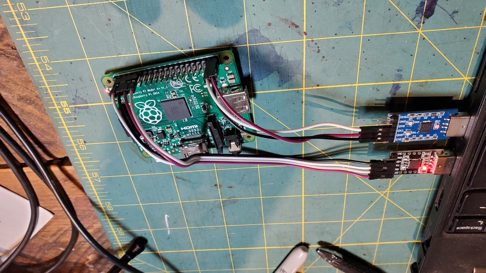
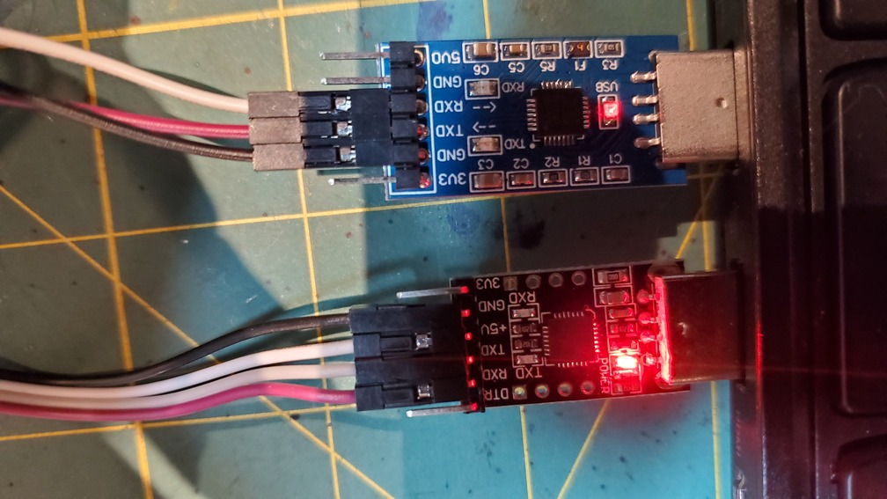
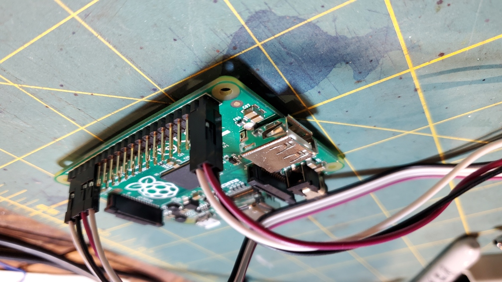

## Building a fast 8n1 GPIO-based UART for output and networking

***Make sure you read the [PRELAB](PRELAB.md), which sketches the
algorithm.***

Now that you can write and verify timing-accurate code, we are going to
use this to implement a software version of the hardware UART protocol 
you configured the pi to use in lab 4.  We'll then use this to make a 
simple, pin-to-pin network on your pi and, as an extension, see how
efficient you can make it, both in reducing latency and in increasing
bandwidth.

While the hardware folks in the class likely won't make this
assumption-mistake it's easy as software people (e.g., me) to assume
things such as: "well, the tty-usb device wants to talk to a 8n1-UART
so I need to configure the pi hardware UART to do so."  This belief,
of course, is completely false --- the 8n1 "protocol" is just a fancy
word for setting pins high or low for some amount of time for output,
and reading them similarly for input.  So, of course, we can do this
just using GPIO.  (You can do the same for other protocols as well,
such as I2C, that are built-in to the pi's hardware.)

Having a transmit and receive implementation will serve us well later,
when we want to connect sensors wirelessly, ship data to a server, etc.

----------------------------------------------------------------
### Checkin

You need:
  1. Your own SW-UART implementation, with a dump from your logic
     analyzer showing that it satisfies the `8n1` timing specification
     for at least a 115200 baud rate.
  2. Also showing that a SW-uart ping-pong implementation can run 
     for thousands of iterations without errors.

There are many extensions (listed at the end).  A few key ones:
  1. Tune the sw-uart so you can do at least 1Mb per second between two
     pi's for one pin.
  2. A parallel version of your SW-uart that can send some number
     (hopefully 8) bits in parallel and an adaptation of your analyzer
     to print out the traces from more than one pin.
  3. Devise a custom network protocol that can send bits faster than
     ours.   One easy one would be to do a four wire protocol where you
     have a clock and a data wire in each direction.

----------------------------------------------------------------
### Part 1: implement `sw_uart_put8`

In this part you'll write your own `sw_uart_put8` and see that it is able
to print `hello world` using a second TTY-USB device to your laptop.

        // libpi/include/sw-uart.h: make a sw_uart_t structure
        sw_uart_t sw_uart_mk_helper(unsigned tx_pin, unsigned rx_pin, unsigned baud);

        // libpi/include/sw-uart.h: transmit <b>: 
        int sw_uart_put8(sw_uart_t *uart, uint8_t b);

Short version of the description below:

   1. Repurpose your `test_gen` routine from last time to emit bits
      at 115200 baud using the 8n1 UART protocol.  See the explanation
      in the [PRELAB](PRELAB.md).
   
      Use your scope to validate that the bits are being output with
      reasonable timing accuracy.

   2. Adapt the code from (1) to implement `sw_uart_put8`.

   3. Then hook up a hardware uart to pin 20 and 21 and make sure you pass
      the tests `code/tests/1-*.c`.

##### step 1: Repurpose `test-gen`

Make a copy of your `test_gen` routine and customize it to transmit the
10 bits needed for the 8n1 UART protocol:

  0. Completely unroll the loop.
  1. The first bit should be a 0 for T cycles.
  2. The next 8 bits should be alternating 0, 1, 0, ....
  3. The last bit should be a 1 for T cycles.

Test it by:
  1. Change `CYCLES_PER_FLIP` in `test-gen/test-gen.h` to 6076.
  2. Recompile it and `scope` and use the `scope` implementation 
     to see the timing  is roughly 6076 cycles per transition.  

##### step 2: Use `test_gen` to build `sw_uart_put8`

Now that it works, change the implementation to take a byte in to control
what bit is sent.  Make sure your `scope` shows the timing still works.

I would use the routine:

            //  libpi/include/cycle-util.h
            // write value <v> on GPIO <pin> until <ncycles> have passed since <start>
            write_cyc_until(unsigned pin, unsigned v, unsigned start, unsigned ncycles);

to keep the code clean.

#### step 3: Test the results.

  
  
  

Congratulations!  You now how an implementation of `sw_uart_put8`.
   1. Drop this into `code/sw-uart.c` 
   2. Hook up the CP2102 tty-usb device as follows:

       1. Hook up the output pin (21) to the rx on the tty-USB.
       2. Hook up the input pin (20) to the tx on the tty-USB.
       3. Connect the tty-usb to your pi's ground.  ***DO NOT CONNECT TO
          ITS POWER!!***

   3. When you plug it in to your laptop, the tty-usb should have a
      light on it and nothing should get hot!

Now, work through the tests `0-putc-test.c` and `0-printk-test.c` the
`code/` directory.  

Since your softare UART is printing through a second UART device, you'll
need to run the `pi-cat` program in a seperate terminal.  As with the
last lab, you'll need to specify which tty-USB device to connect to.
You can see the output using `pi-cat`.

   1. In one terminal:

            # linux: plugged in second
            % pi-cat /dev/ttyUSB1   

   2. In another:

            # linux: plugged in first.
            % my-install /dev/ttyUSB0 1-sw-uart-hello.bin

When I run:

        % my-install /dev/ttyUSB0 0-printk-test.bin 
        opened tty port </dev/ttyUSB0>.
        0: going to print hello world
        1: going to print hello world
        2: going to print hello world
        3: going to print hello world
        4: going to print hello world
        5: going to print hello world
        6: going to print hello world
        7: going to print hello world
        8: going to print hello world
        9: going to print hello world
        DONE!!!

I get the following using `pi-cat`:

        % pi-cat /dev/ttyUSB1
        opened tty port </dev/ttyUSB1>.
        hello world: 0
        hello world: 1
        hello world: 2
        hello world: 3
        hello world: 4
        hello world: 5
        hello world: 6
        hello world: 7
        hello world: 8
        hello world: 9

----------------------------------------------------------------
### Part 2:  implement `sw_uart_get8`

You'll implement the other side now:

        // libpi/include/sw-uart.h
        int sw_uart_get8(my_sw_uart_t *uart);

As described in the [PRELAB](PRELAB.md): Make sure you implement it using 
`write_cyc_until` or an equivalant so that your code is accurate.

There are two tests:
  - `1-getc-test.c`: get a single character (enter using `pi-cat`).
  - `1-gets-test.c`: get a single character (enter using `pi-cat`).

Reception mirrors the above transmit steps:
 1. Wait for a start bit (0).
 2. Delay for another `T+T/2` cycles so that we are in the center of
    the period that the first data bit will be transmitted.  (In our
    example: `6076 + 3038 = 9114`).
 4. Bit-wise or the value of the RX line into the bit at position 0.
 5. Delay another T cycles so we are in the center of the transmission
    of the next data bit.
 6. Bit-wise or the value of the RX line into the bit at position 1.
 7. ...
 8. Wait for the stop bit.    (Note: if you return immediately,
    without waiting for any stop bit, then you can get incorrect results:
    if the last data bit was 0 and you try to read another byte while
    it is still being transmitted you will think it is a start bit!
    Ask me how I know.)

You can work through the rest of the tests.  You should be able to type
in characters and see them print out correctly.

Notes:

  - You cannot directly check receive, since your analyzer cannot see
     pin reads.  As a hack, modify the code so that each time it reads
     the RX pin, it also sets a different pin high --- your scope can
     check that.

  - When you are debugging, as with the bootloader, if you put in a
    `printk` on the receiver, you can miss incoming bits.  Only print
    (or do things that are expensive) when you are not expecting input.
    GPIO pins do not buffer input.  This is a common mistake: I said
    this many many times in cs140e (and I've already said it twice in
    this document!), but at least 1/3 of all students ran into this
    issue at different points.

Great!  That is the main big conceptual hurdle.  The rest of the time
you'll just be making your code better.

----------------------------------------------------------------
## Part 3: use your software UART to build a point-to-point network.

Wiring up the software UART as a network is fairly simple and will look
similar to the previous lab, except you conect the pi's using two wires,
not one.

 - Run the ping-pong test in `code/2-ping-pong.c`
 - This sends an integer back and forth as a pin pong and that the
      value increases from 0 to 4098 with no errors.

----------------------------------------------------------------
### Extension: increase baud rate.

As mentioned above, your UART implementation will be useful later.
So it is worth making it fast --- the faster it is, the more time there
is to compute other stuff on the pi.

Using the techniques from the last lab, see how high you can make the
baud rate.  I have no idea what the limit is.  We seem to only be able
to get about 1Mb a second between the pi and a Unix system --- it would
be interesting if you could beat this.

Checkoff (from above):
  1. Your ping-pong still works, and it gets faster as we expect.
  2. Your scope timing diagram makes sense.

----------------------------------------------------------------
### Extension: increase bandwidth.

As mentioned above, we can set and read many pins in parallel:

  1. Make a version of your code that will transmit and receive up to 8
     bits in parallel.  I would start with just two bits and make sure it
     makes sense.
  2. Extend your scope so that it works with multiple bits.

Checkoff (from above):
  1. Your ping-pong still works, and it gets faster as we expect.
  2. Your scope timing diagram makes sense.

----------------------------------------------------------------
### Extension: Speed: custom protocol.

Two downsides of the UART protocol:
  1. The baud rate is hard-wired in.  You may be able to go (much)
     fast and at other times, may run much slower.
  2. It also can transmit when a receiver is not ready and drop bits.

Design a custom network protocol that solves these problems.  You should
be able to send bits faster than ours and only transmit when the receiver
is waiting.

As one possible approach: use a second line the receiver can use to signal
for when it is ready for the next bit: the sender can then adaptively
run as fast as possible.

I'm very curious how fast you can make this!

----------------------------------------------------------------
### Extension: Speed: over-clocking the pi to reduce error.

One way to get even more speed is to change the speed of the pi CPU, GPU,
memory and other things by modifying `config.txt` on the pi's SD card.
See how far you can reduce the error by changing these.  You'll most
likely have to resort to blog posts to get the full working range of
some of these parameters.

Some writeups:
  - [Official pi page](https://www.raspberrypi.org/documentation/configuration/config-txt/overclocking.md)
  - [Higher values](https://core-electronics.com.au/tutorials/overclocking-your-raspberry-pi.html)

I'm curious how fast you can get it and still have things work!

Note, that if you change the GPU speed, you may not be able to bootload
b/c our UART assumes a fixed 250Mhz clock for it when it computes baud
rate.  You will likely have to change your hardware UART implementation.
I would save any GPU modifications for last.
